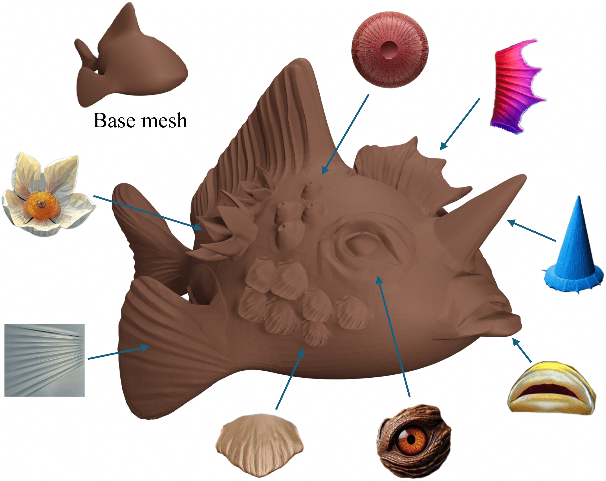

# GenVDM
Pytorch implementation of [[CVPR 2025] GenVDM:Generating Vector Displacement Maps From a Single Image](www.google.com)  [Yuezhi Yang](https://yyuezhi.github.io/), [Qimin Chen](https://qiminchen.github.io/), [Vladimir G. Kim](http://www.vovakim.com/), [Siddhartha Chaudhuri](https://www.cse.iitb.ac.in/~sidch/), [Qixing Huang](https://www.cs.utexas.edu/~huangqx/), [Zhiqin Chen](https://czq142857.github.io/)



### [Paper](www.google.com)  |  [Project page](www.google.com)

## Citation
If you find our work useful in your research, please consider citing:
```
@inproceedings{yang2025genvdm,
  title={GenVDM: Generating Vector Displacement Maps From a Single Image},
  author={Yang, Yuezhi and Chen, Qimin and Kim, Vladimir G and Chaudhuri, Siddhartha and Huang, Qixing and Chen, Zhiqin},
  booktitle={Proceedings of the IEEE/CVF Conference on Computer Vision and Pattern Recognition (CVPR)},
  year={2025},
}
```


## Environment
Please install the environment by running:
```
bash install_env.sh
```

## Pre-trained weights and Datasets
We provide the pre-trained network weights. Please put it in ./checkpoints/example_run directory.

- [GenVDM checkpoint](www.google.com)

Please see dataset directory for instruction on how to download dataset and how to make your own data

## Inference
To generate VDM image, put your image in ./input and run:
```
bash generate.sh <image name> <exp name> <checkpoint name>
```

For example:
```
bash generate.sh ear2 example_run example
```
Notice that your image has to be in png format RGBA image. The object needs to lie in the center of the image. See example images in ./input as an example

## Training
To train the network, please put rendered images in ./dataset/rendering_result
```
python train.py --base config/example_run.yaml --gpus 0,1,2,3,4,5,6,7 --num_nodes 1
```